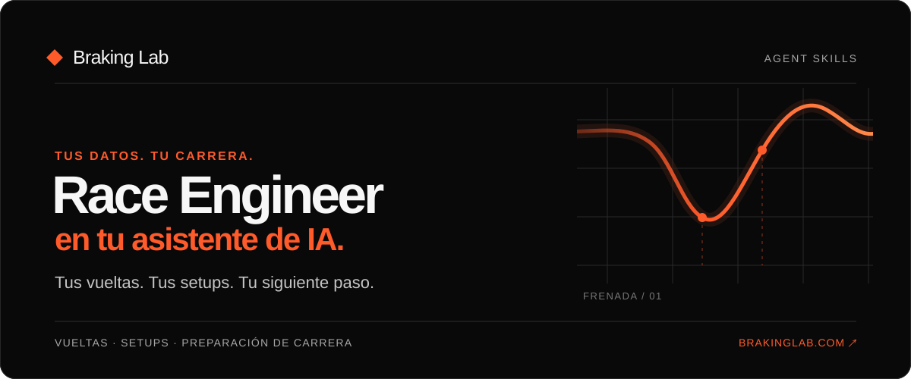

# Race Engineer en tu asistente de IA



[English](README.md)

Pregunta por la vuelta que acabas de hacer, la carrera que estás preparando o el siguiente cambio de setup que quieres probar. Estas diez skills ayudan a tu asistente de IA a usar el **Race Engineer de Braking Lab** con tus propios datos. Si falta una señal, la respuesta debe decirlo. Un cambio de setup sigue siendo una hipótesis hasta que lo pruebas en pista.

| Puedes preguntar                                        | Skill              |
| ------------------------------------------------------- | ------------------ |
| «¿Qué puede hacer mi Race Engineer?»                    | `race-engineer`    |
| «¿Dónde perdí tiempo en mi última sesión en Spa?»       | `debrief`          |
| «El coche subvira a la salida. ¿Qué cambiarías?»        | `setup-coaching`   |
| «Enséñame las versiones de mi setup de LMU.»            | `setup-library`    |
| «Añade la carrera del sábado al calendario.»            | `calendar-events`  |
| «¿Ayudó el cambio de setup después de probarlo?»        | `setup-evaluation` |
| «Guarda mi referencia de frenada para la curva 3.»      | `track-notes`      |
| «¿Qué debería practicar antes de la carrera?»           | `race-week`        |
| «Compara mis dos últimas vueltas.»                      | `lap-comparison`   |
| "Crea un ejercicio de frenado y revisa sus resultados." | `training`         |

## Instala la beta pública

### Claude

Instala el plugin nativo de Claude Code, que incluye las diez skills y la conexión MCP:

```sh
claude plugin marketplace add r-bart/braking-lab-agent-skills
claude plugin install braking-lab-race-engineer@braking-lab
```

Abre una sesión nueva de Claude Code, ejecuta `/mcp` y autoriza tu cuenta de Braking Lab. En Claude chat puedes [importar el ZIP del plugin](docs/install-claude.md) si tu cuenta permite subir plugins.

### ChatGPT

La ficha pública de ChatGPT sigue en preparación. Las cuentas que admiten conectores MCP personalizados en el Modo Desarrollador pueden conectarse ya a `https://mcp.brakinglab.com/mcp`. Consulta el [estado de ChatGPT](docs/install-chatgpt.md).

### Codex, Cursor y otros agentes

Usa el [CLI de Skills](https://www.skills.sh/docs/cli) para elegir agente, ubicación y skills:

```sh
npx skills add r-bart/braking-lab-agent-skills
```

Después conecta `https://mcp.brakinglab.com/mcp` en tu agente y autoriza tu cuenta de Braking Lab. El CLI instala las skills; no configura el MCP. [Pasos por cliente e instalador opcional sin Node](docs/install-cli.md).

Necesitas una cuenta de Braking Lab para las respuestas basadas en datos. La autorización ocurre en tu asistente; la instalación de skills nunca pide tu contraseña ni un token de Braking Lab.

Las skills guían tareas habituales. No limitan lo que puede hacer el MCP, no cambian tu plan ni conceden más acceso. Tu cliente conectado puede seguir usando otras funciones del Race Engineer. Las acciones que guardan o cambian datos siguen sujetas a los permisos de tu cuenta y a las confirmaciones del servidor. [Consulta a qué datos puede acceder el Race Engineer](https://www.brakinglab.com/es/docs/race-engineer/security).

## Estado de la beta

Las diez skills superaron las comprobaciones de formato y catálogo MCP. ChatGPT completó OAuth y consultas de lectura en una cuenta; Codex en staging verificó alta, edición y borrado de una carrera con lectura posterior. Quedan por comprobar la primera respuesta con datos en Claude Code y los flujos completos de otros clientes. La [matriz de soporte](docs/validation/client-support-matrix.md) registra lo observado. Instalar las skills por sí solo no conecta el Race Engineer. Una petición de apertura de Paddock completada no confirma que la interfaz sea visible; la aceptación en el host real sigue pendiente.

El código y los archivos de versión están en este repositorio. Las [notas para mantenimiento](docs/maintainers.md) explican el empaquetado y las comprobaciones.
