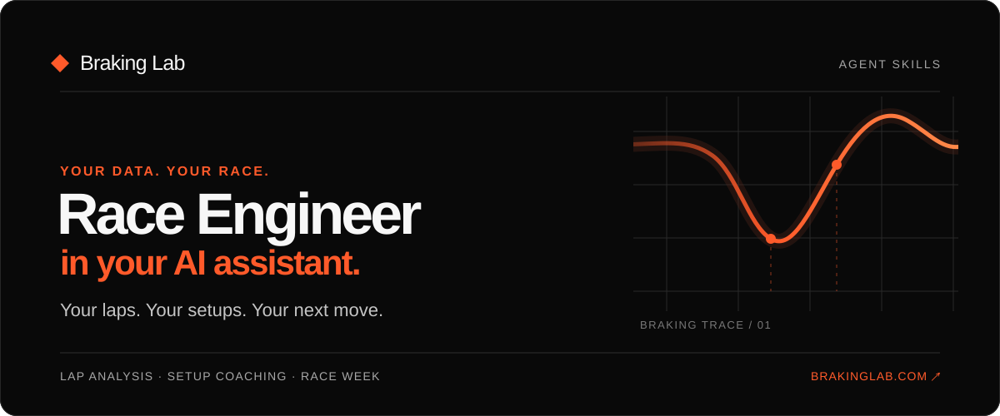

# Race Engineer in your AI assistant



[Español](README.es.md)

Ask about the lap you just drove, the race you are preparing for, or the setup change you want to try. These ten skills help your AI assistant use the **Braking Lab Race Engineer** with your own data. If a signal is missing, the answer should say so. A setup change stays a hypothesis until you try it on track.

| You can ask                                          | Skill              |
| ---------------------------------------------------- | ------------------ |
| “What can my Race Engineer do?”                      | `race-engineer`    |
| “Where did I lose time in my last Spa session?”      | `debrief`          |
| “The car pushes wide on exit. What should I change?” | `setup-coaching`   |
| “Show me the versions of my LMU setup.”              | `setup-library`    |
| “Add next Saturday's race to my calendar.”           | `calendar-events`  |
| “Did the setup change help after I drove it?”        | `setup-evaluation` |
| “Save my braking reference for Turn 3.”              | `track-notes`      |
| “What should I practice before race day?”            | `race-week`        |
| “Compare my last two laps.”                          | `lap-comparison`   |
| "Create a braking exercise and review its results." | `training` |

## Install the public beta

### Claude

Install the native Claude Code plugin, which includes the ten skills and the MCP connection:

```sh
claude plugin marketplace add r-bart/braking-lab-agent-skills
claude plugin install braking-lab-race-engineer@braking-lab
```

Open a new Claude Code session, run `/mcp`, and authorize your Braking Lab account. Claude chat users can [import the plugin ZIP](docs/install-claude.md) if their account supports plugin uploads.

### ChatGPT

The public ChatGPT directory listing is still in preparation. Accounts with custom MCP connectors in Developer Mode can connect to `https://mcp.brakinglab.com/mcp` now. See the [ChatGPT status](docs/install-chatgpt.md).

### Codex, Cursor, and other agents

Use the existing [Skills CLI](https://www.skills.sh/docs/cli) to choose your agent, install location, and skills:

```sh
npx skills add r-bart/braking-lab-agent-skills
```

Then connect `https://mcp.brakinglab.com/mcp` in your agent and authorize your Braking Lab account. The Skills CLI installs the skills; it does not configure the MCP. [Client-specific steps and an optional installer without Node](docs/install-cli.md).

You need a Braking Lab account for data-backed answers. Authorization happens in your AI client; the skills installation never asks for your Braking Lab password or token.

The skills guide common tasks. They do not limit what the MCP can do, change your plan, or grant extra access. Your connected client can still use other Race Engineer functions. Actions that save or change data remain subject to your Braking Lab permissions and the server's confirmation rules. [See what the Race Engineer can access](https://www.brakinglab.com/en/docs/race-engineer/security).

## Beta status

The nine skills passed format and MCP catalog checks. ChatGPT completed OAuth and reading tasks on one account; Codex staging verified calendar create, update, and delete with readback. Claude Code's first data-backed answer and other clients' end-to-end flows still need validation. The [client support matrix](docs/validation/client-support-matrix.md) records what was observed. A skill installation alone does not connect the Race Engineer.

Source and release assets are available in this repository. [Maintainer notes](docs/maintainers.md) explain packaging and checks.
